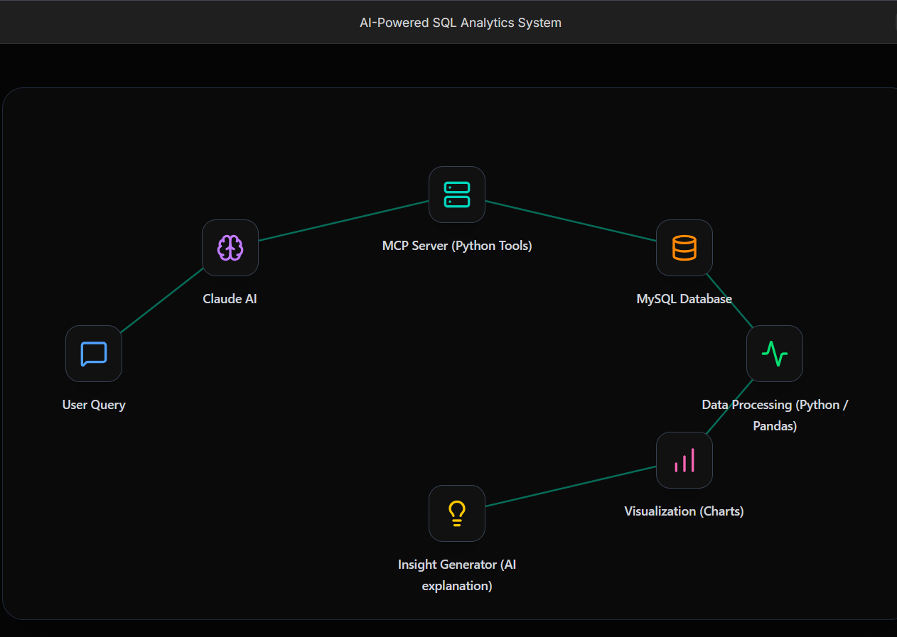
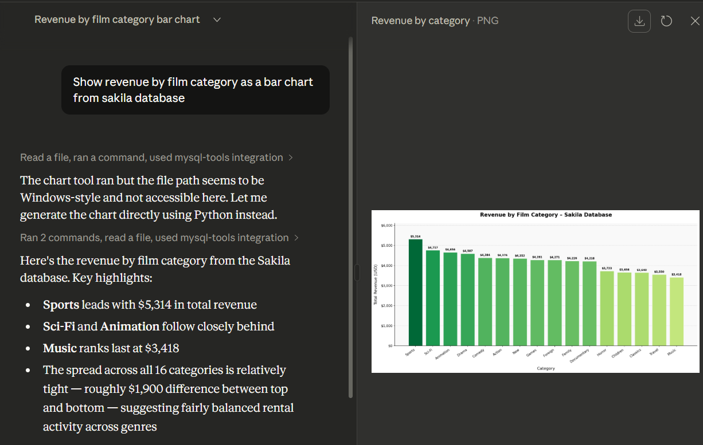
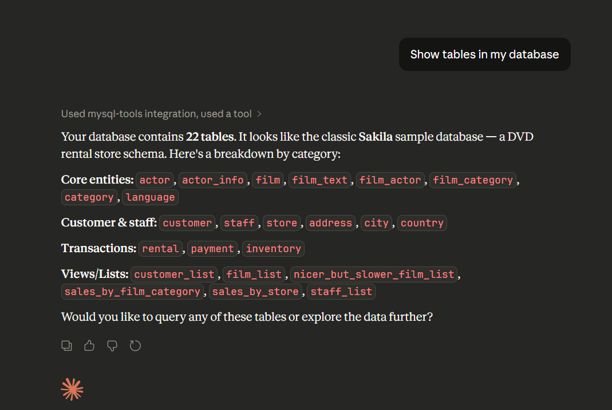

# AI SQL Analytics System using MCP

An AI-powered SQL analytics system that allows users to query a MySQL database using **natural language**.
The system converts user questions into SQL queries, executes them through a **Model Context Protocol (MCP) server**, and generates **visualizations and insights automatically**.

This project demonstrates how AI systems can interact with relational databases to enable **AI-assisted data analysis workflows**.

---

# Live Project Demo

Interactive portfolio site:

https://mcp-mysql-site.vercel.app/

The demo showcases:

• Natural language queries
• Automatic SQL generation
• Database execution
• Data visualization
• AI-generated insights

---

# Project Architecture

The system architecture connects AI, database, and analytics components.



Workflow:

User Query
↓
Claude AI
↓
MCP Server (Python)
↓
MySQL Database
↓
Data Processing
↓
Visualization
↓
AI Insight Generation

---

# Key Features

Natural Language Database Queries
Users ask questions in plain English instead of writing SQL.

AI Generated SQL
Claude AI converts natural language questions into executable SQL queries.

MySQL Integration
Queries are executed on a MySQL database using Python connectors.

Data Visualization
Query results are converted into charts for easier interpretation.

AI Generated Insights
The system summarizes results and highlights key patterns automatically.

Interactive Portfolio Demo
A modern technology-themed interface demonstrates the full pipeline.

---

# Example Queries

Examples of questions that can be asked:

Show revenue by film category

Which customers spend the most money?

Find monthly rental trends

Top rented films

Revenue comparison by store location

---

# Example Visualization

Example output generated from the Sakila database.



---

# Demo Screenshot

Example interaction showing AI query execution and visualization.



---

# Technology Stack

Python
MySQL
Model Context Protocol (MCP)
Claude AI
Matplotlib
Pandas

---

# Project Structure

```
mcp_mysql
│
├── charts
│   └── revenue_by_category.png
│
├── demo
│   └── demo_query.png
│
├── config
│   └── claude_desktop_config_sample.json
│
├── architecture.png
├── db_mcp_server.py
├── db_tools.py
├── example_queries.sql
├── requirements.txt
└── README.md
```

---

# Installation

Clone the repository

```
git clone https://github.com/Peruks/mcp_mysql.git
```

Navigate to the project directory

```
cd mcp_mysql
```

Install dependencies

```
pip install -r requirements.txt
```

---

# Running the MCP Server

Start the MCP server:

```
python db_mcp_server.py
```

The server exposes database operations to Claude AI through the Model Context Protocol.

---

# Claude Desktop Configuration

To connect Claude Desktop to the MCP server, update your Claude configuration file.

Location (Windows):

```
C:\Users\<username>\AppData\Roaming\Claude\claude_desktop_config.json
```

Example configuration:

```
{
  "mcpServers": {
    "mysql-tools": {
      "command": "python",
      "args": [
        "C:\\mcp_mysql_project\\db_mcp_server.py"
      ]
    }
  }
}
```

---

# Database

This project uses the **Sakila sample database**, a MySQL dataset representing a DVD rental business.

Key tables include:

customer
film
category
payment
rental
inventory

---

# Use Cases

AI-assisted data exploration
Automated SQL generation
Conversational database analytics
Rapid business insight generation
AI-powered analytics dashboards

---

# Future Improvements

Real-time dashboards
Interactive chart generation
Automated report generation
Support for multiple databases
Advanced AI insight generation

---

# Author

Perarivalan KS

AI / Data Analytics enthusiast focused on building real-world AI-powered analytics systems.

Portfolio Project Demo:

https://mcp-mysql-site.vercel.app/

---
